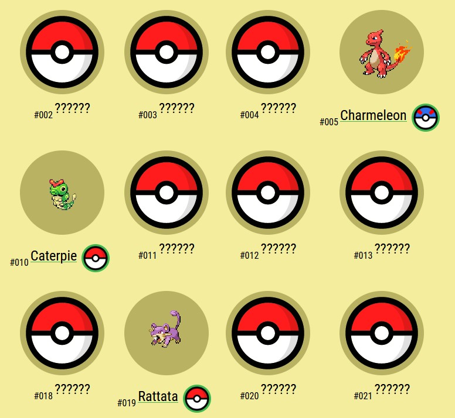
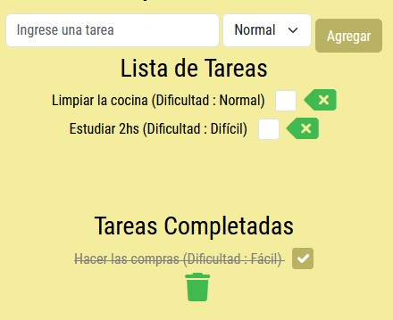
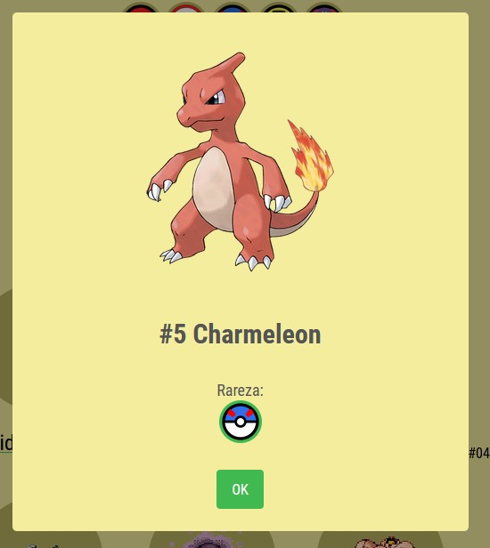
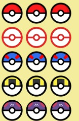
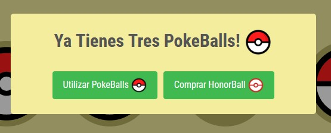
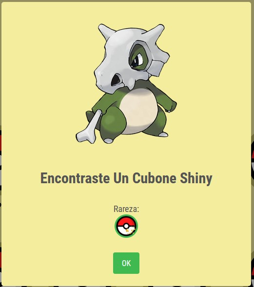

# Proyecto Final Agustin Matias Torres Valenzuela

Curso de Javascript comision 39505

## Completa tu Pokedex llevando a cabo tus tareas de todos los dias!

Descubre una experiencia única con nuestra todo list y Pokedex integrada. ¡Completa tareas y atrapa Pokémon mientras organizas tu vida!

Convierte tus tareas en emocionantes retos Pokémon. Gana puntos y canjéalos por Pokeballs para atrapar a los primeros 151 Pokémon.

¿Estás listo para convertirte en el mejor maestro Pokémon? Organiza tus tareas y gana puntos para obtener las Pokeballs necesarias.

¡Canjea tus puntos por Pokeballs y aumenta tu colección!

Consigue Pokémon raros y épicos al completar tus tareas con nuestra todo list. ¡Demuestra tu habilidad como entrenador!

No te preocupes por Pokémon repetidos. Conviértelos en Pokeballs y obtén nuevas oportunidades para atrapar Pokémon de mayor rareza. (De arriba hacia abajo: Normal, Honor. Super, Ultra, Master)

¿Tienes suficientes Pokeballs? Canjea tus duplicados por Pokémon de la misma rareza o por una pokeball de rareza superior

¡La emoción de encontrar Pokémon shiny está a solo un paso! Completa tus tareas, obtén Pokeballs y descubre la suerte de tener un Pokémon variocolor.

Experimenta la combinación perfecta entre organización y diversión con nuestra todo list. Atrapa Pokémon, completa tareas y alcanza tus metas en un solo lugar.

